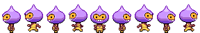
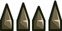

# Platform-Game

> This game involves a dude always on the run while picking stars and jumping across obstacles. If he eventually collide with the obstacles which I called staticKiller. Dude is dead and game ends. And when he falls off the platform, dude also dies and game ends.

[loom-video](https://www.loom.com/share/7aca795c8ab24534bca3947af2d1c733)

## Game Design

### Concept

- Play as a hasty dude and collect coins while jumping from platform to platform and avoiding killer obstacle.
- Collect Coins to increase your score.
- Avoid falling off platforms or colliding with Killer obstacle to not lose the game.

### Controls

You need a keyboard to control the dude.

- Press ⬆️ to jump.
- Press ➡️ to go right.
- Press ⬅️ to go left.

### Assets

|Asset                                      |Description                            |
|-------------------------------------------|---------------------------------------|
|          |dude spritesheet to animate the player|
| |Platform that the player can jump on   |
|       |Stars that the player can collect |
|        |Obstacles that the player needs to avoid  |

## Built With

- Javascript
- Phaser
- Webpack, Babel and Jest

## Live Demo

[Live Demo Link](https://peaceful-engelbart-203c5e.netlify.app/)

## Getting Started

To get a local copy up and running follow these simple example steps.

### Prerequisites

- Node.js
- npm

### Setup

Run `git clone https://github.com/Ceejayski/JS-Phaser-Game.git` in your terminal to clone this repo.

### Install

Install the necesarry dependencies by running `npm install` in the root of cloned repo.

### Usage

open the index.html with a live-server to view the game in your default browser.

### Testing

Run `npm run test` to run the tests.

## Author

👤 **Ceejayski**

- Github: [@ceejayski](https://github.com/ceejayski)
- LinkedIn: [LinkedIn](https://www.linkedin.com/in/okoli-ceejay/)
- Twitter: [Twitter](https://twitter.com/OkoliChijioke10)

## 🤝 Contributing

Contributions, issues, and feature requests are welcome!

## Show your support

Give a ⭐️ if you like this project!

## Acknowledgments

- [@photonStorm](http://phaser.io/tutorials/making-your-first-phaser-3-game/part1)

## 📝 License

This project is [MIT](./LICENSE) licensed.
